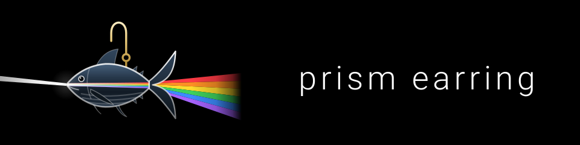

<p align="center">
  
</p>

# prism — DSP コア + オフライン数値検証

Bolt B1(`u1-dsp-core`)と B2(`u2-verification`)の成果物。

| パス | 内容 |
|---|---|
| `dsp/include/prism/PitchShifter.h` | `prism::PitchShifter`。ヘッダオンリー・依存ゼロの純 C++17。音声経路に FFT なし |
| `verify/verify.cpp` | オフライン数値検証ランナー(自前 radix-2 FFT を含む単一実行ファイル) |
| `build.sh` | ビルド + 検証を 1 コマンドで実行 |

## ビルドと実行

```sh
./build.sh          # ソース検査 → -O2 ビルド → 検証 → 決定論/再現性検査
./build.sh --quick  # 数値検証だけ(反復開発用)
```

必要なのは `clang++` のみ(外部ライブラリ・パッケージマネージャ・ビルドツール不要)。
成果物は `build/` に出る。全緑なら終了コード `0`、1 件でも FAIL なら `1`。

`CXX` 環境変数でコンパイラを差し替えられる(`CXX=g++ ./build.sh`)。
`NDEBUG` は意図的に定義しない — 確保カウンタの `assert`(SR-4.2)を有効に保つため。

## 検証結果の読み方

各行が 1 ケース。列は `result / case / metric / measured / expected / tolerance / alloc / note`。

| ケース | 判定 | 終了コードへの寄与 |
|---|---|---|
| `pitch@<fs>/<f>Hz` | 出力 FFT ピーク比が 0.95 ±0.5%(BR2.1) | あり |
| `pitch@<fs>/<f>Hz/<±c>c` | 出力 FFT ピーク比が `2^(c/1200)` ±0.5%。シフト定義域 ±1200 セントの走査(D-G) | あり |
| `latency@<fs>` | 出力が \|y\|>0.05 を初めて超えるサンプル。≤10ms かつ設計値 `getLatencySamples()` と許容差内(BR2.2) | あり |
| `glitch@<fs>` | 隣接差分 >3.0×期待最大スロープ の不連続点数。0 件であること。先頭 250ms は除外(BR2.3) | あり |
| `glitch@<fs>/<±c>c` | 同上を上げ方向でも。閾値は**出力側**のスロープ基準(`3.0×2π·f·ratio·A/fs`) | あり |
| `cpu@<fs>` | 処理時間 / 実時間。**閾値なし・報告のみ・実行環境依存**(BR2.4) | なし |
| `cpu@<fs>/<±c>c` | 定義域の端(跳躍頻度が最大)での同上。報告のみ | なし |
| `contract@<fs>/*` | 契約と境界条件(不正引数の拒否、上下のクランプ、NaN 無視、dryWet=0 の素通し、上げ方向の遅延予算) | あり |

`alloc=0` は「その `process` 計測区間でヒープ確保が 0 回だった」という横断的不変条件(SR-4.2)。
1 回でも起きればその場で `assert` により abort する。**確保検出は `-O0` ビルドが正**
(`-O2` では対になった `new`/`delete` がコンパイラに省略されうる)。`build.sh` は
`-O0` 版も必ずビルドして全緑を要求する。

末尾の 3 検査:

- **determinism (SR-2.4)**: 同一バイナリを 2 回実行し、cpu 行を除いた出力が完全一致すること。
- **reproducibility (SR-2.3)**: `-O0` と `-O2` で検出ピーク `f_out` の差が ±0.015 Hz 以内であること。
- **source checks (SR-1.x)**: ファイル I/O・ソケット・乱数・スレッド/ロックの混入ゼロ、
  および DSP コアに FFT が現れないこと。

## 実測値(Apple M2 / Apple clang 17 / -O2)

| 検査 | fs=44100 | fs=48000 |
|---|---|---|
| pitch 110 Hz | ratio 0.950511(+0.93 cents) | 0.949151(−1.55 cents) |
| pitch 440 Hz | ratio 0.949994(−0.01 cents) | 0.949673(−0.60 cents) |
| pitch 3520 Hz | ratio 0.949884(−0.21 cents) | 0.949906(−0.17 cents) |
| latency | 228 サンプル = **5.17 ms**(設計値 217.5) | 248 サンプル = **5.17 ms**(設計値 236.0) |
| glitch | 0 件(max\|Δy\|=0.0298 / 閾値 0.0940) | 0 件(max\|Δy\|=0.0274 / 閾値 0.0864) |
| cpu | 0.3 %(実時間比) | 0.5 %(実時間比) |
| alloc | 全ケース 0 | 全ケース 0 |

ピッチ精度の帯域特性(既定パラメータ、fs=44100、許容差 ±8.66 cents):

| f (Hz) | 90 | 110 | 130 | 175 | 220 | 300 | 440 | 1000 | 3520 | 6000 |
|---|---|---|---|---|---|---|---|---|---|---|
| 誤差 (cents) | **−15.4** | +0.9 | +0.7 | −0.1 | −0.8 | +0.2 | 0.0 | −0.1 | −0.2 | −0.2 |

約 105 Hz 未満で精度が落ちるのは設計上の帰結(後述 D-A)。

シフト定義域 ±1200 セント(上下 1 オクターブ)の走査。値は測定誤差(cents)、許容差は
全点 ±0.5%(= ±8.66 cents)。期待比は `2^(cents/1200)`:

| cents | −1200 | −200 | −100 | +100 | +200 | +1200 |
|---|---|---|---|---|---|---|
| 期待比 | 0.500000 | 0.890899 | 0.943874 | 1.059463 | 1.122462 | 2.000000 |
| 440 Hz @44.1k | +0.43 | −0.26 | +0.25 | −0.26 | −0.00 | −0.08 |
| 440 Hz @48k | −1.62 | +0.06 | −0.08 | −0.19 | −0.06 | +0.72 |
| 110 Hz @44.1k | +1.64 | — | — | +0.80 | — | −0.48 |
| 110 Hz @48k | −1.00 | — | — | +0.77 | — | +0.15 |
| 3520 Hz @44.1k | +0.18 | — | — | −0.01 | — | −0.05 |
| 3520 Hz @48k | −0.01 | — | — | +0.02 | — | +0.00 |

最悪でも 1.64 cents(0.095%)で、±0.5% の 1/5 に収まる。**±1200 でも許容差を
緩めていない**(緩和は不要だった)。

方向別の遅延と負荷(fs=48000、既定 crossfade 50ms):

| シフト | 設計値遅延 | cpu 比 @44.1k / @48k | グリッチ |
|---|---|---|---|
| −89(既定) | 236 サンプル = **5.17 ms** | 0.26 % / 0.49 % | 0 件 |
| −1200 | 236 サンプル = 5.17 ms | 1.99 % / 4.24 % | 0 件 |
| +100 | 350 サンプル = 7.29 ms | — | 0 件 |
| +1200 | 350 サンプル = **7.29 ms** | 3.91 % / 8.43 % | 0 件 |

上げ方向の遅延がガード帯ぶん増える理由は D-G。cpu 比が端で上がるのは、跳躍の頻度が
`|1−ratio|` に比例して増え、そのたびに相関探索(D-B)が走るため。いずれも 10 % 未満。

## 設計からの逸脱

承認済み設計文書と異なる実装を行った箇所と、その根拠。

### D-A(最重要)遅延スイープをクロスフェード窓長から分離した

- **設計**: D-01 / BR1.4 — 読み出しヘッドは窓長 `window = crossfade_ms×fs/1000` ごとに再配置され、
  遅れの振幅は `D = (1−ratio)×window`(既定で 2.5 ms)。
- **実装**: 遅れの振幅 `D` を設計定数 `kSweepMs = 9.5 ms` とし、ヘッドは
  `lag ∈ [8 サンプル, 8+D]` を走査して端で跳躍する(クロスフェード窓長は「フェード時間」だけを表す)。
- **理由**: 元設計のままでは **ピッチ精度検証が原理的に通らない**。ヘッドの跳躍は
  読み出し位相を入力位相へ再同期させるため、出力スペクトルは `f_in + k·(1−ratio)fs/D`
  の線上にしか立たない。目的の `f_in×0.95` は `f_in − f_in(1−ratio)` にあり、線間隔の
  `D/周期` 倍だけ離れている。`D` が入力の 1 周期より短い帯域ではピークが `f_in` に戻る。
  実測(元設計): 110 Hz で ratio=1.0006、440 Hz で 0.9090(いずれも FAIL、3520 Hz のみ PASS)。
  ピーク誤差の上限は `(1−ratio)·fs/(2D)` で、`D` を大きくする以外に縮める手段がない。
- **`kSweepMs = 9.5` の根拠**: NFR-1 の 10 ms 予算。最大遅れ = `baseOffset + D` = 9.68 ms。
  この値は「正しくシフトできる最低周波数 ≈ 1/9.5ms ≈ 105 Hz」を意味する。
  **遅延予算と最低周波数はトレードオフの関係にあり、両立できない**というのが本件の物理的な結論。

### D-A2 走査幅 `sweep` を `prepare()` の引数にした(既定は 9.5 ms のまま)

- **実装**: `prepare(sampleRate, maxBlockFrames, sweepMs = kSweepMs)`。範囲は
  `kSweepMsMin = 2.0` 〜 `kSweepMsMax = 100.0`(非有限値は既定値へ丸める)。
  採用値は `getSweepMs()` で読める。容量 `capacity_`・遅延 `baseOffset + sweep/2`・
  跳躍間隔はすべて既に `sweepSamples_` から導かれているので、そのまま追従する。
- **理由**: D-A の「遅延予算と最低周波数のトレードオフ」は**経路ごとに答えが違う**。
  - **マイク経路**: イヤホンから生音が漏れ込むので 10 ms 予算が効く → 既定 9.5 ms。
  - **捕獲経路**(Android の AudioPlaybackCapture で拾った他アプリの再生音):
    耳に届くのは処理後の音だけで、比較対象になる生音が無い。遅延は「動画と音が
    ずれる」程度の意味しか持たないため、**40 ms** を採る。
- **跳躍間隔 = `sweep ÷ |1−比|`**。これが 2 つ目の理由で、シフト量が大きいほど効く。
  −89 セント(`|1−比| = 0.050`)では 9.5 ms でも跳躍間隔 190 ms だが、
  ±1200 セント(`|1−比| = 1.0 / 0.5`)では **9.5 ms → 跳躍間隔 9.5〜19 ms**。
  1 秒に 50〜100 回も波形が継ぎ直されると、シフト量が大きいときのざらつきが目立つ。
  40 ms なら 40〜80 ms 間隔まで伸びる。既定 −89 セントでは 800 ms 間隔。
- **検証**: 走査幅 40 ms で 110 / 440 / 3520 Hz の −89 セント精度、`±1200` セントの
  比 2.0 / 0.5、および `getLatencySamples() == baseOffset + sweep/2` を検査に追加した
  (`sweep@*/latency-design`、`pitch@*/sw40`)。**既定 9.5 ms の測定値は 1 桁も変わっていない。**

### D-B 跳躍量を波形同期(正規化相互相関)で選ぶ

- **設計**: 跳躍量は固定(= 蓄積した遅れ)。
- **実装**: 跳躍時に、直近 512 サンプルの正規化相互相関が最大になる跳躍量を
  `[0.35×最大, 最大]` の範囲で探索する(WSOLA 相当)。
- **理由**: D-A で `D` を予算いっぱいまで広げても、110 Hz では `D` がちょうど 1 周期分しかなく、
  固定跳躍では整数周期に一致しない。相関で選ぶと跳躍量が局所周期の整数倍に近づき、
  位相の再同期が可聴・可測レベルで消える。上表のとおり 110 Hz〜6 kHz で誤差 1 cent 未満。
- **コスト**: 跳躍のたびに ch あたり最大 ~140k 回の積和。跳躍間隔は既定で 170 ms 程度なので
  平均負荷への寄与は小さい(実測 CPU 比 0.3〜0.5 %)。確保・ロック・I/O は発生しない。

### D-C クロスフェードを等パワーから定振幅(線形)に変更

- **設計**: BR1.6 — `gA=cos θ, gB=sin θ` の等パワー合成。
- **実装**: `1−u` / `u` の線形合成。
- **理由**: 等パワー合成は 2 系統が**無相関**であることを前提にした形。D-B により 2 本のヘッドは
  波形同期して相関するため、等パワーだとフェード中に振幅が最大 +3 dB 膨らみ、
  跳躍周期(既定 ~170 ms)の周期的トレモロになる。相関済みの信号には定振幅が正しい。

### D-D `getLatencySamples()` の式

- **設計**: BR1.7 — `baseOffset + (1−ratio)×window/2`。
- **実装**: `baseOffset + sweep/2`(遅れがスイープ区間を一様に走査するため、その平均)。
- D-A でスイープの定義が変わったことに伴う変更。**BR2.2 の許容差式は変更していない**
  (`(1−ratio)×window/2 + 8` のまま)。実測と設計値の差は 10〜12 サンプルで、許容差 63〜68 に収まる。

### D-E クロスフェード位相を ch 共有から ch 独立に

- **設計**: logical-components — θ とラッチ済み窓長は両 ch 共有。
- **実装**: ヘッド状態・跳躍スケジュール・フェード位相を ch ごとに保持。
- **理由**: `shiftCentsL/R` が独立(FR-1.2)だと遅れの蓄積速度が ch ごとに違い、跳躍時刻も一致しない。
  L=R のとき両 ch は完全に同期して動く。

### D-G シフト範囲を ±1200 セント(上下 1 オクターブ)に拡張した

- **契約**: 契約 1 / BR1.2 — `shift_cents_L/R` の定義域は `-150 〜 0`(下げ専用)。
- **実装**: `kShiftCentsMin = -1200`, `kShiftCentsMax = +1200`。既定値 −89 は不変。
- **理由**: 「上げたい人にも使ってもらいたい。半音・全音・1 オクターブをボタンで
  切り替えたい」という利用者要望。契約文書(`aidlc/` 配下)は編集していないため、
  ここに逸脱として記録する。
- **アルゴリズム上の帰結**: 読み出し速度 `r = 2^(c/1200)` が 1 を超えると遅れ `lag` は
  **減少**する。したがって走査の向き・跳躍の向き・相関探索の向きがすべて反転する:
  - 下げ(r<1): `lag` は上端 `baseOffset+sweep` まで増加 → 前方(遅れが減る側)へ跳躍。
    相関は `oldBase-k` と `oldBase-k+j` を比較する(従来どおり)。
  - 上げ(r>1): `lag` は下端まで減少 → 後方(遅れが増える側)へ跳躍。
    相関は `oldBase-k` と `oldBase-k-j` を比較する。
- **ガード帯(上げ方向のみ +sweep/4)**: クロスフェード中、旧ヘッドは走査を続けるため
  端を越えて走り抜ける。下げ方向は「遅れが増える側」へ抜けるだけで無害(容量の問題)
  だが、上げ方向は「遅れが減る側」= **まだ書き込んでいない未来**へ抜けてしまう。
  そこで上げ方向の走査域を `sweep/4` だけ持ち上げ、その帯を旧ヘッドの走行余地にする。
  - 代替案(走査域の中で先回りして跳ぶ)は跳躍探索の範囲を `sweep` から `0.75×sweep` に
    縮める。110 Hz の 1 周期は 401 サンプル @44.1k で、`0.75×419 = 314` では 1 周期を
    含められず低域の精度が崩れる(D-A / D-B と同じ理由)。**スイープ幅を削らない方を採った**。
  - 代償は上げ方向の遅延増: 設計値 `baseOffset + guard + sweep/2` = **7.29 ms**
    (下げは従来どおり 5.17 ms)。いずれも NFR-1 の 10 ms 予算内。
    `getLatencySamples()` は L/R のシフト方向を見て大きい方を返す。
- **クロスフェード長の上限**: 旧ヘッドの走り抜け幅 = `fadeLen × |1−r|` を予算内に
  収めるため、`fadeLen ≤ 予算 / |1−r|` を課した(上げ = ガード帯、下げ = 跳躍量)。
  下げ方向ではこれが「次の跳躍までの走行長」= 跳躍間隔そのものになる。
- **容量**: `prepare` は最悪ケース(比 0.5〜2.0)基準で
  `baseOffset + 3×sweep + windowMax + 相関窓 + maxBlock + 2` を確保する。
  併せて毎サンプル `lag` を `[2, capacity−相関窓−maxBlock−2]` へ丸める安全網を入れた
  (パラメータ急変でフェード中に `|1−r|` が跳ね上がる場合の保険。通常動作では効かない)。

### D-H クロスフェード窓長の上限を 200 ms にし、内部の丸めを外した

- **契約**: 契約 1 — `crossfade_ms` の定義域は `10 〜 100`。
- **実装**: `kCrossfadeMsMax = 200`。あわせて `startJump()` にあった
  `runLimit = 跳躍量 × 8` というキャップを撤廃した。
- **理由**: `runLimit` は下げ方向では常に `byExcursion = 跳躍量 / |1−比|` より小さく、
  **窓長 100 ms を実効 76 ms 程度に丸めてしまっていた**(−89 セント、fs=44.1k)。
  「最小 10 ms と最大 100 ms で違いが聞き分けられない」という利用者の報告の原因はこれ。
  安全側の上限は `byExcursion`(旧ヘッドの走り抜け幅の予算)だけで足りる — 下げは
  跳躍量、上げはガード帯が予算で、どちらも撤廃前後で変わっていない。
- **上限 200 ms の意味**: 既定 −89 セント・sweep 9.5 ms では跳躍間隔が
  `9.5 / 0.0501 ≈ 190 ms` なので、200 ms は「跳躍から次の跳躍まで**常時**
  クロスフェードし続ける」極端に相当する(実効長は `byExcursion` で 190 ms に丸まる)。
  この極端まで含めて耳で聴き比べられるようにするのが目的。
- **既定値への影響はゼロ**: 既定の窓長 50 ms では `runLimit`(= 跳躍量 × 8 ≈ 3352 サンプル)
  が窓長(2205 サンプル)より大きく、そもそも効いていなかった。検証の実測値は全ケース
  変更前と一致する。
- **検証**: 窓長 200 ms・−89 セントでの 110 / 440 / 3520 Hz のピッチ精度と、
  −89 / +1200 セントのグリッチ検査を追加(`pitch@*/cf200`、`glitch@*/cf200`)。
  いずれもグリッチ 0 件、ピッチ誤差は最悪 1.35 cents。

### D-F 配置とテストケースの追加

- `u2-verification` の配置は `unit-of-work.md` の `tests/` ではなく `verify/`(作業指示に従った)。
- 検証マトリクスに `contract@*` 4 ケース(不正引数拒否・クランプ・NaN 無視・dryWet=0 素通し)を追加。
  construction ガードレール「happy path + エラー/境界 2 件以上」を満たすための**追加**であり、
  BR2.1〜BR2.5 の判定式・閾値・既存ケースは一切変更していない。

## 既知の制約

- **約 105 Hz 未満のピッチ精度**: 上表のとおり 90 Hz で −15 cents。D-A の物理的帰結。
  改善するには遅延スイープを広げる = 遅延を増やすしかない(90 Hz を許容差内に収めるには
  スイープ 11.2 ms 以上、最大遅れ 11.4 ms 相当)。人の話し声の基本周波数はおおむね 85〜255 Hz
  なので、男性低音域の基音は精度が落ちる。実使用での評価は B3(Web デモ)で行う。
- **瞬時最大遅れ**: 主ヘッドは最大 9.68 ms。クロスフェード中の旧ヘッドはさらに
  `(1−ratio)×窓長`(既定 50 ms 窓で 2.6 ms)まで遅れが伸びる。
  検証で測る最初の到達(−26 dBFS)は 5.17 ms。
- **上げ方向のエイリアシング**: 読み出しが `r` 倍速になるため、`fs/(2r)` を超える入力成分は
  折り返す(+1200 セント = 2 倍速なら 12 kHz 以上 @48k)。アンチエイリアスフィルタは
  入れていない — 追加すると遅延と CPU がかさみ、最重要制約と衝突するため。
  検証で使う 110 / 440 / 3520 Hz は影響を受けない。
- **上げ方向の遅延は 7.29 ms**(下げは 5.17 ms)。ガード帯ぶん増える(D-G)。
  瞬時最大遅れは `baseOffset + guard + sweep` = 12.0 ms @48k。
- **端のシフト量では CPU が上がる**: 跳躍頻度が `|1−ratio|` に比例するため、
  +1200 セントで実時間比 8.4 %(既定 −89 では 0.5 %)。Web 経路(Node 22 / M2、
  128 フレームのレンダ量子に対する比)では WASM 12.5 % / JS フォールバック 14.4 %
  (既定 −89 では 0.4 % / 0.8 %)。実機(Pixel)の余裕は Web デモで確認する。
- **デバッグビルドの `process` はリアルタイム安全でない**(`assert` が abort/stderr を伴う)。
  実時間経路(B3 の AudioWorklet)は `NDEBUG` 付きでビルドすること。
- `prepare` / `reset` は音声スレッド停止中、または音声スレッド自身から呼ぶこと
  (`prepared_`・バッファ・ヘッド状態はスレッド間で保護されない)。

## アセット一覧

ロゴは 1 つの作図(耳飾りの金具から吊るされたカツオ / 左から入る白色光 / 尾から広がる六色)を
用途ごとの座標系へ組み替えたもの。SVG が原本で、PNG は headless Chrome からの書き出し。

| ファイル | 寸法 | 用途 |
|---|---|---|
| `web/assets/logo.svg` | 640×320 (2:1) | 原本。ワードマークを下端中央に置いた縦長寄りの構図。アプリのヘッダで使用 |
| `web/assets/logo-horizontal.svg` | 960×240 (4:1) | 左にアイコン部・右にワードマークの横並び。README 先頭やページヘッダ向け |
| `web/assets/banner-wide.svg` | 1200×630 | OG / SNS カードの原本。虹を右半分いっぱいに伸ばし、右下にワードマーク |
| `web/assets/icon.svg` | 512×512 | 角丸(r=96)の黒プレート。ファビコン・通常アイコンの原本 |
| `web/assets/icon-maskable.svg` | 512×512 | Android maskable 用。背景は角丸なしの黒全面、図柄は中央の安全円(直径 80%)内 |
| `web/assets/icon-foreground.svg` | 512×512 | Android アダプティブアイコンの前景層。背景透過、図柄は安全円(直径 66%)内。黒の背景層と重ねて使う |
| `web/favicon.svg` | — | ブラウザタブ用 |
| `web/assets/icon-192.png` | 192×192 | manifest `purpose: any` |
| `web/assets/icon-512.png` | 512×512 | manifest `purpose: any`。インストール時のスプラッシュ |
| `web/assets/icon-maskable-512.png` | 512×512 | manifest `purpose: maskable`。ホーム画面でシステム側が任意の形に切り抜く |
| `web/assets/apple-touch-icon-180.png` | 180×180 | iOS ホーム画面。角丸は OS が付けるため四隅まで黒で塗る |
| `web/assets/og-1200x630.png` | 1200×630 | `og:image` / `twitter:image`。絶対 URL で参照する |
| `web/manifest.webmanifest` | — | PWA マニフェスト。`start_url` / `scope` は `./`(GitHub Pages のサブパス配信のため) |

### PNG の作り直し

SVG を直すと PNG は自動では追随しない。書き出しは headless Chrome で行う
(`` を実寸で置いた薄いラッパー HTML を撮る)。

```sh
CHROME="/Applications/Google Chrome.app/Contents/MacOS/Google Chrome"
"$CHROME" --headless=new --disable-gpu --hide-scrollbars \
  --force-device-scale-factor=1 --default-background-color=00000000 \
  --window-size=512,512 --screenshot=out.png file:///path/to/wrapper.html
```

macOS では幅 500px 未満のウィンドウが丸められるため、192 / 180 は 512 で撮ってから
`sips -z 192 192 in.png --out out.png` で縮小する。
`apple-touch-icon-180.png` だけはラッパーの背景を `#000000` にして四隅の透過を潰す。
