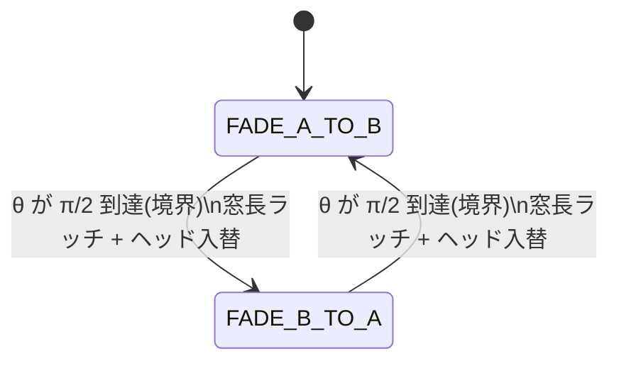
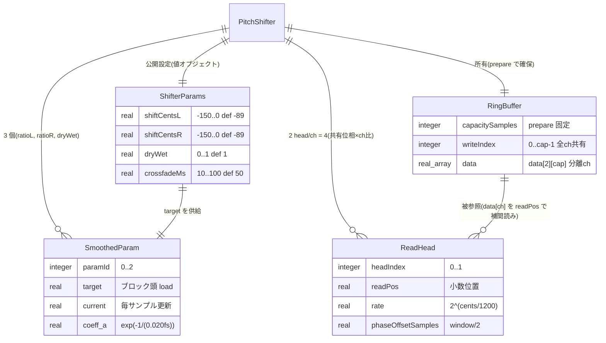

# 機能仕様 — u1-dsp-core

`prism::PitchShifter` の振る舞いを技術非依存に記述する(数式のみ、コード無し)。
エンティティは entities.md、ルールは rules.md を参照。契約は contract-summary.md 契約 1。

## WF-1 prepare(sampleRate, maxBlockFrames)

初期化。ヒープ確保はここだけで行う(BR1.5)。

1. sampleRate fs と maxBlockFrames を受け取り妥当性確認。`sampleRate < 8000 || sampleRate > 192000 || maxBlockFrames < 1` のいずれかが真なら false を返す(= fs∈[8000,192000] かつ maxBlockFrames≥1 のときのみ成功)。[contract-summary 契約1]
2. 最大窓長 window_max = round(100*fs/1000)(crossfadeMs 上限 100)を算出。
3. `RingBuffer` を channel-major の分離バッファ data[2][capacitySamples] として確保。`capacitySamples` = window_max + maxBlockFrames + 補間余裕(≥2) を包含する長さに確定し、両 ch を 0 クリア。writeIndex(全 ch 共有)=0。[NFR-2, D-01]
4. 平滑係数 `SmoothedParam.coeff_a` = exp(-1/(0.020*fs)) を算出(BR1.3)。
5. per-sample 平滑器 ratioL(ch0)・ratioR(ch1)・dryWet の `current`/`target` を default 値に初期化(shiftCentsL/R=-89 → ratioL/R、dryWet=1)。crossfadeMs=50 は per-sample 平滑せず境界ラッチ値として保持。
6. baseOffset = 8 サンプル(DesignConstants、≈0.17ms @48kHz)。window_samples = round(50*fs/1000) をラッチ。`ReadHead` A/B の phaseOffsetSamples(0, window_samples/2)、各 ch の readPos を writeIndex から baseOffset(+phaseOffsetSamples)手前に設定、rate=2^(-89/1200)(ch ごとに独立)。
7. 成功で true を返す。以後 process() 呼び出し可。

## WF-2 process(in, out, numFrames) — ブロック処理

前提: prepare 成功済み、numFrames ≤ maxBlockFrames、in/out は [2][numFrames](BR1.8)。全経路リアルタイム安全(BR1.5)。

1. **ブロック頭で atomic を各 1 回 load**(FR-1.5, D-03): shiftCentsL/R・dryWet・crossfadeMs の目標値を格納(クランプ済み値、BR1.2)。shiftCentsL → ratioL.target(ch0=L)、shiftCentsR → ratioR.target(ch1=R)、dryWet → dryWet.target(両 ch 共通)。crossfadeMs は境界ラッチ用に latch(per-sample 平滑対象外、Q1-A)。
2. per-sample ループ(i=0..numFrames-1)。パラメータ→ch 対応を明示する:
   1. **平滑**: ratioL・ratioR・dryWet を current = a*current + (1-a)*target で更新(BR1.3)。dryWet は両 ch 共通で 1 個の平滑器。
   2. **rate 更新(ch 独立)**: ch0(L) は ReadHead.rate = 2^(ratioL.current/1200)、ch1(R) は 2^(ratioR.current/1200)(BR1.1)。各 ch は自分の平滑シフトから自分の rate を持つ。
   3. **書き込み**: 各 ch について RingBuffer.data[ch][writeIndex] = in[ch][i]。
   4. **2 ヘッド読み出し(線形補間、ch ごと)**: 各 ch・各ヘッドで readPos の整数部 n と小数部 f から y = (1-f)*data[ch][n] + f*data[ch][(n+1) mod capacity](D-02)。readPos += その ch の rate(モジュロ capacity)。
   5. **等パワークロスフェード**: クロスフェード位相 θ から gA=cos(θ), gB=sin(θ) で out_wet[ch] = gA*yA + gB*yB(BR1.6)。θ は両 ch 共通の共有位相機構として進める。
   6. **窓境界ラッチ**(WF-4): θ が境界に到達したら window_samples を latch 済み crossfadeMs から再ラッチし、ヘッド役割を入れ替え phaseOffsetSamples を更新(BR1.4, Q1-A)。
   7. **dry/wet ミックス**: out[ch][i] = (1-dryWet.current)*in[ch][i] + dryWet.current*out_wet[ch](平滑後 dryWet を両 ch へ、FR-1.3)。
   8. **writeIndex 前進**: フレーム内の全 ch 書き込み後、writeIndex = (writeIndex+1) mod capacity を 1 回だけ実行(全 ch 共有)。
3. 戻り値なし(noexcept)。

## WF-3 reset()

状態クリア(確保済みバッファは保持、BR1.5)。noexcept。

1. RingBuffer.data[2][*] を両 ch 0 クリア、writeIndex(全 ch 共有)=0。
2. 各 ch の ReadHead.readPos を writeIndex から baseOffset(=8 サンプル)+phaseOffsetSamples 手前へ再設定、θ を初期位相へ。
3. per-sample 平滑器 ratioL・ratioR・dryWet の current = target(整定済み扱い)。
4. capacitySamples・coeff_a・確保領域は不変。

## WF-4 クロスフェード境界の窓長ラッチ状態機械

crossfadeMs 変更を「次のクロスフェード境界」でのみ窓長へ反映し、位相不連続ゼロを保証する(BR1.4, Q1-A, NFR-4)。

- 状態: `FADE_A_TO_B`(headA→headB へフェード中)/ `FADE_B_TO_A`(逆)。
- 各状態で θ が 0→π/2 へ線形進行。θ 到達(境界)で以下を実行し反対状態へ遷移:
  1. pending_window = round(current_crossfadeMs*fs/1000)(BR1.4)。
  2. window_samples = pending_window、phaseOffsetSamples = window_samples/2 を latch。
  3. 新しく「後方」になるヘッドの readPos を writeIndex から基準オフセット + phaseOffsetSamples 手前に再配置。
  4. θ を 0 にリセットし役割を入れ替え。
- 境界外では旧 window_samples を維持(即時再構成しない)。

テキスト代替: 初期状態は FADE_A_TO_B。θ が π/2 に達するたびに(=クロスフェード境界)pending window をラッチしヘッド役割を入れ替え、FADE_A_TO_B ⇄ FADE_B_TO_A を交互に遷移する。窓長変更は境界時にのみ反映される。

## 派生 ER 図(entities.md より)

テキスト代替: PitchShifter は 1 つの ShifterParams(公開設定)と 1 つの RingBuffer(所有、channel-major の data[2][cap]、writeIndex は全 ch 共有)を持ち、per-sample 平滑器 SmoothedParam を 3 個(ratioL=ch0・ratioR=ch1・dryWet=両ch共通、paramId 0..2)、ReadHead を ch あたり 2 個(headIndex 0/1、計 4)持つ。2 本のヘッドは共有位相機構で、各 ch にその ch の ratio を適用する。crossfadeMs は per-sample 平滑せず境界でラッチする。ReadHead は RingBuffer の data[ch] を readPos の線形補間で読む。baseOffset(=8 サンプル)は基準読み出しオフセット(BR1.7)。

## 派生ルールサマリ

| 参照 | 適用 WF | 要旨 |
|---|---|---|
| BR1.1 | WF-2.2.2 | rate=2^(cents/1200) |
| BR1.2 | WF-2.1(セッター) | 定義域クランプ・非有限無視 |
| BR1.3 | WF-2.2.1 | per-sample 指数平滑 a=exp(-1/(0.020fs)) |
| BR1.4 | WF-2.2.6, WF-4 | 窓長=round(crossfadeMs*fs/1000)、境界ラッチ |
| BR1.5 | WF-2 全体 | リアルタイム安全 |
| BR1.6 | WF-2.2.5 | 2 ヘッド等パワー(cos/sin)合成 |
| BR1.7 | getLatencySamples | latency=baseOffset+(1-ratio)*window/2 |
| BR1.8 | WF-2 前提 | モノラル複製は呼び出し側 |

## Assumptions & Open Questions

None.

## Review

**Reviewer:** aidlc-architecture-reviewer-agent
**Date:** 2026-08-27T21:25:42Z
**Iteration:** 2
**Verdict:** READY

### Findings

| ID | Severity | Location | Finding | Required action | Status |
|---|---|---|---|---|---|
| R-01 | Critical | entities.md > DesignConstants.baseOffset; rules.md > BR1.7 | baseOffset was undefined; now defined as 8 samples with worst-case budget check | Verify baseOffset = 8 samples (0.17ms @48kHz), worst-case latency ≈8.5ms ≤ 10ms budget | Resolved |
| R-02 | Major | entities.md > SmoothedParam cardinality; functional-spec.md > WF-2.2 | param→channel mapping was ambiguous; now explicit | shiftCentsL→ch0 ratioL, shiftCentsR→ch1 ratioR, dryWet common (both ch), crossfadeMs boundary-latched only | Resolved |
| R-03 | Minor | rules.md > BR1.7 | getLatencySamples design value stability | Confirmed: uses latched window_samples, pending changes do not affect returned value | Resolved |
| R-04 | Major | entities.md > RingBuffer; functional-spec.md > WF-1, WF-2.2 | RingBuffer layout was ambiguous; now channel-major | data[2][capacitySamples] with shared writeIndex documented; linear interpolation read path confirmed | Resolved |
| R-05 | Minor | functional-spec.md > WF-1.1 | prepare() validity range for sample rate and block frames | Confirmed: sampleRate ∈ [8000, 192000] Hz, maxBlockFrames ≥ 1 explicitly checked before allocation | Resolved |
| R-06 | Minor | entities.md > ReadHead (ER note) | ReadHead multi-channel architecture | Clarified: 2 read heads share phase mechanism (phaseOffset/θ progression); each channel applies its own ratio (ratioL/ratioR independently) | Resolved |
| R-07 | Minor | entities.md > ReadHead identifier | ReadHead identifier scope ambiguity | Cardinality states "2 per channel" (4 total for stereo), but identifier lists headIndex {0,1} only; clarify that headIndex is unique within each channel's scope, or add explicit channel attribute to identifier | New |

### Summary

All prior critical and major findings are resolved and verified consistent across entities.md, rules.md, and functional-spec.md. The baseOffset is now explicitly defined with worst-case budget confirmation. Parameter-to-channel mapping is clear and verifiable in WF-2. RingBuffer layout is specified channel-major with proper memory model. One minor documentation clarity issue identified (ReadHead identifier scope), which does not block implementation as the functional-spec and ER diagram clarify the per-channel scoping. Design is sound and implementable.
