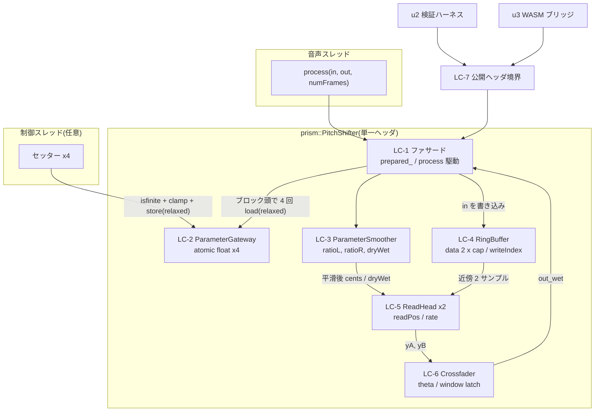

# 論理コンポーネント — u1-dsp-core

`prism::PitchShifter` の内部を責務単位に区分し、失敗ドメイン・共有リソース・スレッド境界・可視性を明示する。
**物理ファイルは分割しない**(Q4-A)。本書の区分は責務と不変条件の所有者を定めるための論理境界であり、実装は単一ヘッダ `dsp/include/prism/PitchShifter.h` に収める。
出典タグ: BR1.x / WF-n は functional-design、SD-n / INV-n は security-design、契約 n は inception/contract-design、Q1〜Q4 は本ステージ質問票。

## コンポーネント一覧

| ID | コンポーネント | 責務 | 所有する不変条件 | 可視性 |
|---|---|---|---|---|
| LC-1 | `PitchShifter`(ファサード) | 公開 7 メソッドの実装。前提条件違反の縮退(SD-3)。`prepared_` の管理。ブロック頭の atomic load とサンプルループの駆動(WF-2) | `prepared_ == true` のみ process が実処理を行う | **public** |
| LC-2 | `ParameterGateway` | 4 セッターの `isfinite` 検査 → クランプ → `atomic<float>` store(SD-4.1, BR1.2)。`process` 側の relaxed load | 非有限値は store されない。store 済み値は必ず定義域内 | private |
| LC-3 | `ParameterSmoother` | per-sample 一次指数平滑 ×3(ratioL / ratioR / dryWet、BR1.3)。デノーマル対策(1e-20 加算 + 到達スナップ、SD-4.2) | `current` は `target` へ単調に漸近し、デノーマルを生成しない | private |
| LC-4 | `RingBuffer` | 固定長 channel-major バッファ `data[2][cap]` の所有と書き込み。`prepare` での唯一のヒープ確保(BR1.5) | INV-1, INV-4 | private |
| LC-5 | `ReadHead` ×2 | 分数位置 `readPos` の前進(`rate = 2^(cents/1200)`、BR1.1)と近傍 2 サンプルの線形補間読み(D-02)。ch ごとにその ch の `rate` を適用 | INV-2, INV-3 | private |
| LC-6 | `Crossfader` | クロスフェード位相 θ の進行、等パワーゲイン `cos`/`sin` 合成(BR1.6)、窓境界での窓長ラッチとヘッド役割入替(WF-4, BR1.4) | `gA^2 + gB^2 = 1`。`window_samples` は境界でのみ変化する | private |
| LC-7 | 公開ヘッダ境界 | u2/u3 に対する唯一の接触面。契約 1 のシグネチャと事前条件を固定する | 公開型は `prism::PitchShifter` 1 個のみ | **boundary** |

`getLatencySamples()` は LC-1 が LC-6 のラッチ済み `window_samples` と LC-3 の現在 ratio から算出する(BR1.7)。未ラッチの pending 窓長は反映しない。

## 構成図

テキスト代替: 制御スレッドの 4 セッターは LC-2 ParameterGateway に対して「非有限値検査 → クランプ → relaxed store」を行う。音声スレッドの `process` は LC-1 ファサードに入り、ブロック頭で LC-2 から 4 値を relaxed load したあと per-sample ループを駆動する。ループ内では LC-3 ParameterSmoother が平滑値を出し、それを LC-5 ReadHead の `rate` に反映する。LC-1 は入力を LC-4 RingBuffer に書き込み、LC-5 が LC-4 から近傍 2 サンプルを補間読みして yA/yB を作り、LC-6 Crossfader が等パワー合成して out_wet を LC-1 に返す。u2 検証ハーネスと u3 WASM ブリッジはいずれも LC-7 公開ヘッダ境界を通してのみ LC-1 に到達し、内部コンポーネントには到達できない。

## 失敗ドメインとブラストラディウス

u1 はライブラリであり、プロセス境界・ネットワーク境界・再起動単位を持たない。したがって**失敗ドメインは呼び出し元プロセスと同一の 1 個**であり、サービス分離・サーキットブレーカ・フェイルオーバといった手段は原理的に適用できない。分離の手段は型のカプセル化と不変条件に限られる。

| 障害 | 影響範囲 | 緩和(設計解) |
|---|---|---|
| 添字の範囲外アクセス | 呼び出し元プロセス全体(メモリ破壊 → クラッシュ) | 折り返しを LC-4/LC-5 の単一ヘルパへ集約、INV-1〜INV-4(SD-2)。到達経路を LC-7 の 7 メソッドに限定(SD-6) |
| 未初期化 process 呼び出し | 出力が無音になる(メモリ安全は維持) | LC-1 の `prepared_` 判定でゼロ埋め縮退(SD-3)。u2 の 4 検証がすべて FAIL するため必ず検出される |
| リアルタイム違反(確保・ロック) | 音声ドロップアウト・優先度逆転(可聴、機能停止) | LC-2 を atomic のみに限定、確保を LC-4 の `prepare` に閉じる、`noexcept` 徹底(SD-5) |
| デノーマルによる CPU スパイク | 音声ドロップアウト | 発生源が LC-3 のみであることを確認済み。LC-3 内で 1e-20 加算 + 到達スナップ(SD-4.2) |
| NaN 入力の残留 | 最大約 100ms 出力が NaN | `reset()`(LC-1 → LC-4/LC-5/LC-6 を初期化)で除去。u3 の UI に reset を露出する根拠 |
| 確保失敗(`prepare`) | 初期化が失敗し以後ゼロ埋め | `prepare` が false を返し、契約 2 の `ps_prepare`→0 → 契約 3 の `{type:"error"}` で UI まで可視化(SD-3) |

## 共有リソース

| リソース | 共有範囲 | 保護 |
|---|---|---|
| `atomic<float>` ×4(LC-2) | **制御スレッド ↔ 音声スレッド** — u1 で唯一のクロススレッド共有 | ロックフリー atomic、relaxed 順序(Q1-A)。`is_always_lock_free` を static_assert |
| `writeIndex`(LC-4) | 両 ch 共有。1 フレーム内で全 ch 書き込み後に 1 回だけ前進(WF-2.2.8) | 音声スレッド単独所有。ch ごとに持たせない設計により ch 間の位相ずれが原理的に起きない |
| θ とラッチ済み `window_samples`(LC-6) | 両 ch 共有(共有位相機構) | 音声スレッド単独所有。ch 独立なのは `rate` のみ(ratioL/ratioR) |
| `data[2][cap]` / `capacitySamples`(LC-4) | `prepare` で確定し以後サイズ不変 | サイズは音声スレッドから変更されない(BR1.5) |

`dryWet` の平滑器は両 ch 共通で 1 個、`ratioL`/`ratioR` は ch ごとに 1 個ずつ(LC-3、計 3 個)。この非対称は「複聴の可能性があるため L/R のシフト量を独立にする」という要件(FR-1.2)に由来し、それ以外の状態は共有して ch 間の一貫性を構造的に保証する。

## スレッド境界

- **音声スレッド**: `process` のみ。LC-1〜LC-6 の全内部状態を単独所有する。
- **任意スレッド**: 4 セッター(LC-2)。lock-free、いつでも呼べる(契約 1)。
- **`prepare` / `reset`**: 音声スレッドが停止している間、または音声スレッド自身から呼ぶ。契約 1 はこれを明文化していないが、`prepared_`・`data`・`readPos` はスレッド間で保護されないため、`process` と並行に呼ぶとデータ競合になる。**契約 1 の事前条件として追記することを推奨**(security-design A-3)。u3 の Worklet は `prepare` を `{type:"ready"}` 送出前に完了させるので実装上は自然に満たされるが、契約に書かれていない前提は将来の消費者が破りうる。

## u2 / u3 から見た境界(LC-7)

- 接触面は「`dsp/include/prism/PitchShifter.h` を include し `prism::PitchShifter` を使う」だけ。ビルド成果物・リンク・ビルドシステムは不要(tech-stack-decisions)。
- **u2(オフライン検証)**: 公開面のみの黒箱検証で 4 つの数値検証(ピッチ精度 0.95±0.5% @110/440/3520 Hz、処理部遅延 ≤10ms、グリッチゼロ、CPU 余裕)をすべて賄う。内部コンポーネントを直接叩けないが、4 検証はいずれも入出力ベースなので内部への到達は不要。
- **u3(WASM ブリッジ)**: 契約 2 の `extern "C"` 関数群がこのヘッダを include して薄くラップするだけ。ロジックを持たない(team-practices のレイヤ分離)。
- 内部型を公開しない対価は、単一ファイルが 400 行規模になることと内部コンポーネントの単体テストができないこと。前者はコンポーネント境界を本書で文書化することで補い、後者は上記の黒箱検証で受容する(Q4-A)。

## Assumptions & Open Questions

- A-1: 単一ヘッダの規模を 400 行程度と見積る。これを大きく超える場合は LC 単位での物理分割(内部ヘッダを `detail/` に置き、公開ヘッダからのみ include する形)を再検討する。判断は code-generation 時の実測行数で行う。
- A-2: `prepare`/`reset` の呼び出しスレッド前提(上記スレッド境界)は契約 1 に未記載である。contract-design への追記が入るまでは本書と security-design A-3 が唯一の記録になる。
