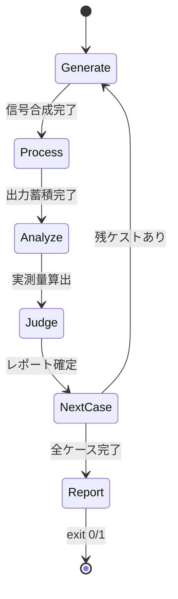
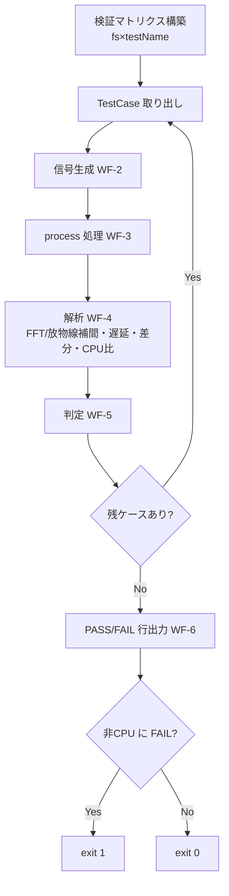

# 機能仕様 — u2-verification

オフライン数値検証ランナー(VerificationHarness)の振る舞い。技術非依存(数式のみ)。
エンティティは entities.md、判定ルールは rules.md を参照。検証対象は u1 の contract-summary 契約 1。

## WF-1 検証マトリクスの走査

1. fs∈{44100, 48000} × testName∈{pitch, latency, glitch, cpu} の TestCase 集合を構築(BR2.5)。
2. 各 TestCase について WF-2〜WF-5 を順次実行(逐次ランナー、並行なし)。
3. 全ケースの VerificationReport を収集し WF-6 で終了コードを決定。

## WF-2 信号生成(signal generation)

TestCase.signalSpec に従いオフラインで入力信号を合成(外部ファイル/ネットワーク不要, NFR-6)。

- pitch: 正弦波 f∈{110,440,3520} Hz、既定振幅、整定に十分な長さ + FFT 窓長。
- latency: 単位インパルス(warmup reset 後、sample 0 に振幅 1.0 の 1 サンプル、以降 0)。
- glitch: 単一周波数の連続正弦波(長時間)。
- cpu: 一定長信号(正弦波またはノイズ)。

## WF-3 処理(process)

1. u1 の PitchShifter を prepare(fs, maxBlockFrames) で初期化、既定パラメータを設定(BR2.1〜BR2.3 は既定条件で判定)。
2. 生成信号をブロック単位で process に通し出力を蓄積(モノラル信号は L=R 複製して 2ch 化, BR1.8/D-06)。
3. cpu ケースでは std::chrono::steady_clock で 512 フレームブロック単位の処理ループ全体の経過時間を計測(WF-4 で比算出)。

## WF-4 解析(analyze)

- pitch: 出力に radix-2 FFT(オフライン限定, FR-3.1)を適用、最大ピーク近傍を放物線補間して f_out を精密化、ratio=f_out/f_in(BR2.1)。
- latency: 出力絶対値が |y| > 0.05(-26 dBFS)を初めて超える index を latency_samples、latency_ms=index/fs*1000。設計値 L_design=getLatencySamples() を取得(BR2.2)。
- glitch: 隣接差分 |y[n]-y[n-1]| > k*maxSlope(k=3.0、maxSlope=2π*f*A/fs)を不連続として計数。先頭 warmup 250ms は除外(BR2.3)。
- cpu: cpuRatio=elapsedProcessingSeconds/(numFrames/fs)、小数第 3 位まで表示(BR2.4)。

## WF-5 判定(judge)

各 VerificationReport の passed を rules.md 基準で決定:
- pitch: |ratio-0.95| ≤ 0.95*0.005(BR2.1)。
- latency: latency_ms ≤ 10 かつ |latency_samples - L_design| ≤ (1-ratio)*window_samples/2 + 8 サンプル(BR2.2)。
- glitch: glitch_count == 0(BR2.3)。
- cpu: 常に passed=true(報告のみ, BR2.4/Q2-A)。

## WF-6 報告(report)と終了コード

1. ケースごとに "PASS"/"FAIL" 行 + caseName + measured/expected/tolerance を標準出力(Q2-A)。
2. cpu ケースは比の値を情報表示(閾値なし)。
3. 非 CPU ケースに 1 件でも passed=false があれば exit_code=1、なければ 0(BR2.5)。

## 状態機械(逐次ランナー、自明)

テキスト代替: 各ケースは Generate→Process→Analyze→Judge を直列に通り、レポートを確定して次ケースへ。全ケース完了後に Report で PASS/FAIL 行を出し、非 CPU ケースに FAIL があれば exit 1、なければ exit 0。並行実行や分岐はない。

## 検証フロー(flowchart)

テキスト代替: マトリクスから TestCase を順に取り、信号生成→処理→解析→判定を繰り返す。全ケース終了後に PASS/FAIL 行を出力し、CPU 以外に FAIL があれば exit 1、なければ exit 0。

## 派生ルールサマリ

| 参照 | 適用 WF | 要旨 |
|---|---|---|
| BR2.1 | WF-4, WF-5 | ピッチ比 0.95±0.5%(FFT+放物線補間) |
| BR2.2 | WF-4, WF-5 | 遅延 ≤10ms かつ \|実測-設計値\| ≤ (1-ratio)*window/2 + 8 サンプル、閾値 \|y\|>0.05 |
| BR2.3 | WF-4, WF-5 | \|Δy\| > 3.0*maxSlope の不連続 0 件、warmup 250ms 除外 |
| BR2.4 | WF-4, WF-5 | steady_clock/512 フレームブロック、cpuRatio 小数第3位で報告のみ |
| BR2.5 | WF-1, WF-6 | 両 fs 実行 + per-case PASS/FAIL + exit code |

## Assumptions & Open Questions

None.

## Review

**Reviewer:** aidlc-architecture-reviewer-agent
**Iteration:** 2
**Verdict:** READY
