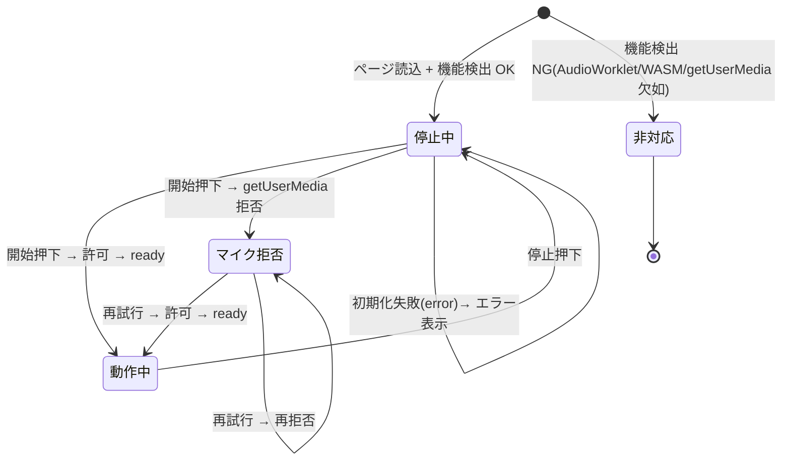

# 機能仕様 — u3-web-demo

UI 専用 Unit(kind=ui)。本ステージ規則により、UI Unit の functional-spec は entities/rules を持たず単独で正典となる。
refined-mockups の DOM/状態/インタラクション仕様に準拠。契約は contract-summary の契約 2(WASM)・契約 3(postMessage)。
コンポーネント構成は frontend-components.md を参照。出典: FR-4.x/NFR は requirements.md、D-04/D-05/D-06 は decisions.md、Q3 は functional-design-questions.md。

## 画面状態機械

4 状態: 停止中 / 動作中 / マイク拒否 / 非対応。

テキスト代替: ページ読込時に機能検出。AudioWorklet/WASM/getUserMedia のいずれか欠如なら「非対応」(対応ブラウザ案内、終端)。揃っていれば「停止中」。開始押下で getUserMedia を要求し、許可 + ready なら「動作中」、拒否なら「マイク拒否」(案内 + 再試行ボタン)。再試行で許可されれば「動作中」、再拒否なら「マイク拒否」を維持。動作中に停止押下で「停止中」。初期化失敗(error)時は「停止中」に留まりエラー表示。

## WF-1 デモ起動(start)[US1.1, FR-4.1/FR-4.3]

1. 開始ボタン押下(状態=停止中)。
2. getUserMedia を `audio: {echoCancellation:false, noiseSuppression:false, autoGainControl:false}` で要求(FR-4.3, D-06 の前段)。
3. 拒否/エラー時 → WF-3 へ。許可時 → 続行。
4. AudioContext 構築 → AudioWorklet モジュール(SINGLE_FILE 内包の WASM 込み JS)を addModule(Q3-A, WASM 単一ファイル埋め込み)。
5. Worklet が WASM ロード + ps_prepare を実行。成功で `{type:"ready"}` を UI へ(契約 3)。失敗(WASM ロード不可 OR ps_prepare が 0)で `{type:"error", message}`(契約 3, レビュー R-01 の 2 トリガ)。
6. ready 受信 → グラフ接続(MediaStreamSource → AudioWorkletNode → destination)、状態=動作中。モノラル入力の L=R 複製は Worklet 側(D-06)。
7. error 受信 → エラー領域(role=alert)にメッセージ表示、状態=停止中。

## WF-2 デモ停止(stop)[US1.1]

1. 停止ボタン押下(状態=動作中)。
2. グラフ切断、MediaStream トラック停止、AudioContext を suspend/close。
3. 状態=停止中。エラー領域クリア。

## WF-3 マイク拒否からの復帰(retry)[US1.3, FR-4.4]

1. getUserMedia 拒否(WF-1.3)→ 状態=マイク拒否。
2. 許可手順の案内文 + 再試行ボタンを表示(refined-mockups のエラー画面と一致)。
3. 再試行ボタン押下 → WF-1.2 から再実行。許可されれば動作中、再拒否ならマイク拒否を維持。

## WF-4 非対応ブラウザ案内 [US1.3, FR-4.4]

1. ページ読込時に AudioWorklet / WASM / getUserMedia の機能検出。
2. いずれか欠如 → 状態=非対応。対応ブラウザ(Chrome 最新安定版 / Safari 17+)を案内し操作系を無効化。

## WF-5 スライダー操作と左右連動 [US1.2, FR-4.2/FR-1.2〜FR-1.5]

1. 4 スライダー(shiftCentsL/R・dryWet・crossfadeMs)。範囲/刻みは frontend-components.md の検証仕様。
2. input イベントで `{type:"param", id:0..3, value}` を port.postMessage(契約 3、id は契約 2 と同一)。
3. 左右連動トグル ON 時: shiftCentsL 操作で id=0/1 両方を、shiftCentsR 操作でも両方を同値送信(UIState.linkLR)。
4. 値適用は Worklet→WASM 経由でコアの per-sample 平滑(BR1.3, FR-1.5)を通り、滑らかに反映。

## WF-6 遅延内訳表示 [US1.4, FR-4.2/NFR-1]

1. Worklet が開始時 + 1 秒ごとに `{type:"latency", dspLatencyMs}` を送出(D-04, 契約 3)。
2. UI は 3 成分を算出・表示(UIState.latencyBreakdown):
   - 出力遅延 = AudioContext.baseLatency + outputLatency(WebAudio 報告値、実行時取得)。
   - ブロック遅延 = 128(レンダ量子)× 2 ÷ fs(入出力バッファ、実行時算出)。
   - DSP 内部遅延 = 受信 dspLatencyMs(コア設計値, BR1.7)。
3. 3 成分の合算値を併記。

## WASM 単一ファイル埋め込み決定 [Q3-A, FR-4.1]

emcc の `-sSINGLE_FILE=1` で WASM を JS(worklet モジュール)に内包し、配布物を index.html + worklet.js(+ main.js)の静的数枚に抑える。file:// でも同一オリジン問題を回避しやすい。外部 CDN・解析スクリプト・外部送信なし(NFR-6)。getUserMedia は echoCancellation / noiseSuppression / autoGainControl を無効化して取得(FR-4.3)。

## Assumptions & Open Questions

None.

## Review

**Reviewer:** aidlc-architecture-reviewer-agent
**Date:** 2026-08-27T21:14:48Z
**Iteration:** 1
**Verdict:** READY

### Findings

| ID | Severity | Location | Finding | Required action | Status |
|---|---|---|---|---|---|
| R-01 | Major | WF-1 Step 5, Error triggers | ps_create failure not enumerated as error trigger; contract 2 specifies ps_create() can return 0 (failure), but WF-1.5 lists only "WASM ロード不可 OR ps_prepare が 0" — leaving ps_create failure unhandled in design, risking invalid handle passed to ps_prepare | Add ps_create to error triggers: "失敗(WASM ロード不可 OR ps_create が 0 OR ps_prepare が 0)" | New |

### Summary

State machine architecture is sound: all four states (停止中, 動作中, マイク拒否, 非対応) are reachable, transitions match refined-mockups and interaction-spec, and error recovery paths (WF-3) are complete. postMessage protocol conforms to contract 3: ready/latency/error message types and id mapping are correct, and the UI→Worklet parameter-send path (WF-5) matches contract 2 parameter enumeration. getUserMedia constraint disabling (FR-4.3) is consistently specified across WF-1, frontend-components, and interaction-spec. All 11 acceptance criteria (AC1.1.1–AC1.4.2) are traced to workflows with "OK" status; traceability is complete. Slider ranges (-150..0, 0..1, 10..100) match contract 1 API bounds exactly. One design gap: ps_create error case from contract 2 is not mentioned in WF-1 error handling, creating ambiguity about initialization-phase failure scenarios. This is tractable (adding one line to enumerate all error triggers); does not block construction.
