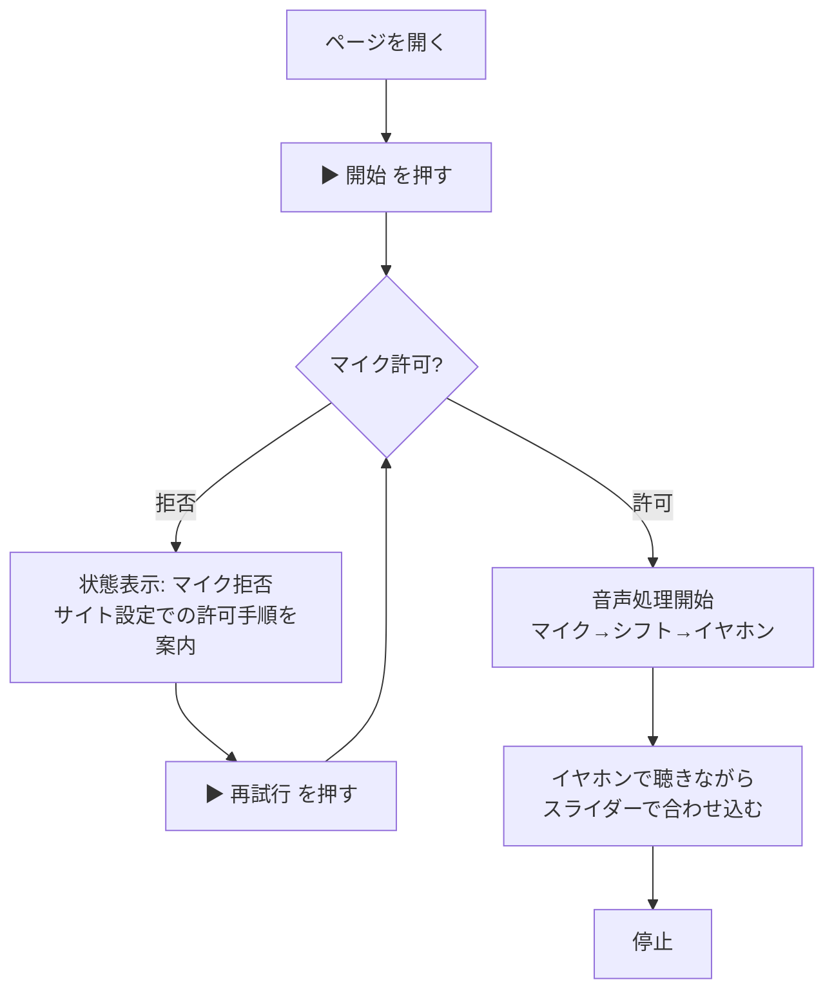

# ユーザーフロー — prism Web デモ

テキストフォールバック: 開く → 開始 → マイク許可(拒否時はサイト設定での許可手順を案内し、再試行ボタンで許可ダイアログへ戻る)→ 聴きながらスライダー調整 → 停止。1 画面で完結し、インストール・設定は不要。非対応ブラウザでは対応ブラウザ(Chrome / Safari 最新版)を案内する。[Q2]

前提: イヤホン推奨(スピーカー再生はハウリングする)。ページ上に注意書きを 1 行置く。[Q2]

## Assumptions & Open Questions

None.
